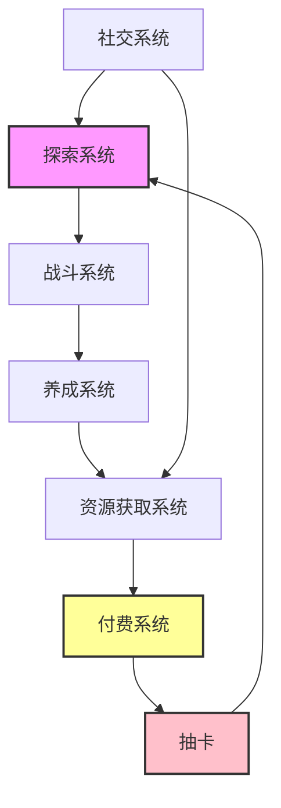
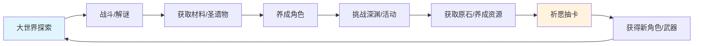
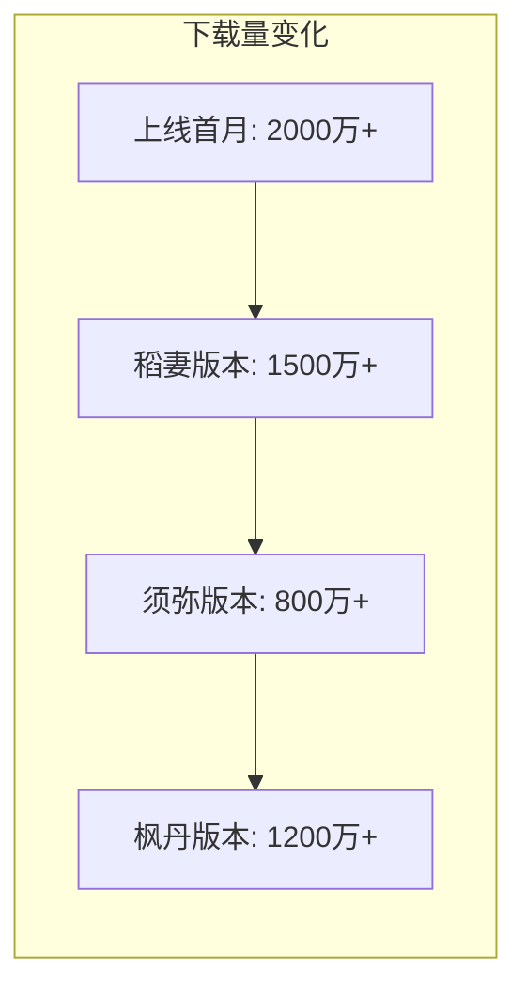
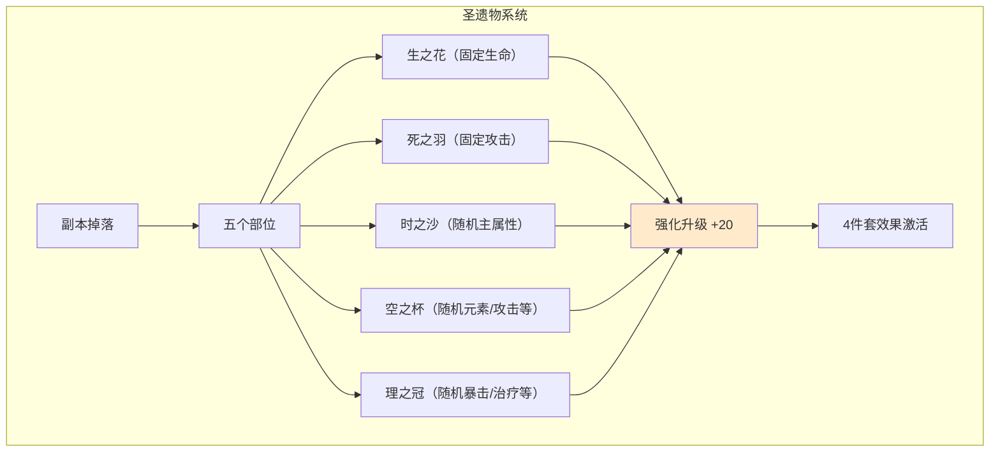
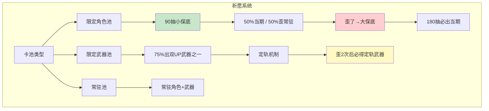

# 🌟 《原神》游戏拆解分析报告

> **报告人**：秋月白
> **分析视角**：游戏运营 / 系统设计
> **游戏版本**：2.0 ~ 3.2（稻妻~须弥早期）
> **核心聚焦**：祈愿系统 + 圣遗物系统

---

## 一、游戏概述

### 1.1 基本信息

| 项目 | 内容 |
|------|------|
| 游戏名称 | 原神（Genshin Impact） |
| 开发商 / 发行商 | 米哈游（miHoYo） |
| 游戏类型 | 开放世界角色扮演游戏（RPG） |
| 世界观 | 幻想世界“提瓦特”七大王国，融合多国文化元素 |
| 美术风格 | 日式二次元卡通渲染，色彩明快，角色设计精美 |
| 支持平台 | iOS / Android / PC / PS4 / PS5 / Switch（待定） |
| 当前分析版本区间 | 2.0 ~ 3.2 |

### 1.2 系统框架总览

**核心模块**：
- **探索系统**：大世界地图、七天神像、神瞳、解谜、宝箱、隐藏任务
- **战斗系统**：元素反应机制、四人小队搭配、连招与元素共鸣
- **养成系统**：角色等级、天赋、命之座、武器、圣遗物
- **资源获取系统**：原粹树脂（体力）、每日委托、周常、征讨领域、版本活动
- **付费系统**：祈愿（卡池）、商城、月卡、纪行（战令）
- **社交系统**：联机(最多4人)、尘歌壶家园拜访

### 1.3 核心体验闭环

**运营解读**：
- **探索** = 免费内容“饵”
- **圣遗物系统** = 无限消耗的“线”
- **祈愿系统** = 付费转化的“钩”
- 整套循环将玩家的时间投入和情感投入，最终导流至付费行为。

---

## 二、游戏市场表现（外围数据）

> 数据来源：SensorTower、七麦数据、App Store畅销榜（2021~2022年估算值）

### 2.1 下载趋势图（文字说明）

**趋势分析**：新国家开放时下载量回升，整体呈波浪式下降，但每次大版本更新仍有显著峰值。

### 2.2 收入表现统计表

| 时间段 | 全球月流水（估算） | 畅销榜排名变化 |
|--------|-------------------|----------------|
| 2021年Q4（雷电将军卡池） | 约3亿美元 | iOS US/Japan Top 1 |
| 2022年Q1（钟离复刻+甘雨） | 约2亿美元 | Top 3 |
| 2022年Q3（纳西妲卡池） | 约1.8亿美元 | Top 2 |
| 2023年Q3（枫丹版本） | 约2.5亿美元 | Top 2 |

**核心结论**：角色卡池是收入波动的核心驱动因素，每版本首周卡池占该版本收入的60~70%。

### 2.3 用户口碑概况

| 平台 | 评分 | 正面关键词 | 负面关键词 |
|------|------|------------|------------|
| App Store（国服） | 4.5 / 5.0 | 音乐、美术、世界探索、角色塑造 | 圣遗物随机性、复刻周期长 |
| TapTap | 5.8 / 10 | 免费内容量、无PVP | 长草期、体力系统、卡池毒池 |
| B站 | N/A（推荐/不推荐） | 版本直播、角色PV | 发福利少、复刻安排不合理 |

**舆情总评**：游戏品质获玩家高度认可，但运营节奏（卡池安排与长草期管理）长期存在争议。

---

## 三、核心玩法深度分析——阵眼

### 3.1 圣遗物系统——长线留存的“疼痛引擎”

#### 3.1.1 系统结构图

#### 3.1.2 核心规则说明

| 项目 | 规则 |
|------|------|
| 获取途径 | 消耗原粹树脂，挑战秘境副本 |
| 主属性规则 | 生之花、死之羽固定；其余部位随机 |
| 副词条规则 | 随机生成1~4条，强化时每4级增加或强化一条 |
| 升星 | 三星→四星→五星，只有五星值得长期投资 |
| 套装效果 | 2件套 + 4件套 |

#### 3.1.3 运营设计意图 & 心理洞察

| 维度 | 内容 |
|------|------|
| **设计目的** | 提供无止境的成长追求，维持DAU；通过随机性平滑付费差距 |
| **正面驱动力** | 出金 → 好主词条 → 双暴副词条 = 中彩票般快感 |
| **负面驱动力** | 连续多日出垃圾 = 挫败感累积 → 流失风险 |
| **用户分层** | **重氪/肝帝**：买满体力，追求阳寿圣遗物；**月卡玩家**：追求小毕业（主词条对）；**白嫖**：时间换运气 |

#### 3.1.4 优缺点与优化建议

**✅ 优点**
- 极低成本驱动高DAU，提高游戏粘性。
- 随机性让重氪无法完全碾压白嫖（脸黑的重氪不如脸好的白嫖），维护生态平衡。

**❌ 缺点**
- 长期无效刷取导致挫败感积累，中轻度玩家易弃坑。
- 新角色需要刷全新套装，增加练新角色的成本。

**💡 优化建议（运营导向）**
- 引入“圣遗物定向自选”机制：每消耗一定树脂（如10万）可获得一次自选主词条礼盒。
- 增加“副词条重铸”功能（消耗垃圾圣遗物+材料定向强化某一条）。
- 定期在版本活动中发放“自选套装自选部位”道具（如异梦溶媒）。

---

### 3.2 祈愿系统——付费转化的“控制泵”

#### 3.2.1 系统结构图

#### 3.2.2 核心规则说明

| 项目 | 规则 |
|------|------|
| 消耗道具 | 纠缠之缘（限定池） / 相遇之缘（常驻池） |
| 单抽价格 | 160原石 / 12元（约） |
| 武器池特殊性 | 双UP+定轨系统，坑更深 |
| 命之座 | 重复获得同角色最多6次，极大提升角色机制和数值 |
| 副产物 | 星尘（每月可兑换5抽）、星辉（可兑换角色/武器） |

#### 3.2.3 运营设计意图 & 心理洞察

| 维度 | 内容 |
|------|------|
| **设计目的** | 建立付费阶梯（月卡→大小月卡→首充→重氪）；通过保底降低流失风险；通过沉没成本刺激冲动消费 |
| **沉没成本心理** | 小保底歪了→需要补大保底→玩家为了不让前面投入白费，更容易充值 |
| **选择焦虑** | 双复刻卡池（如甘雨+钟离）创造“二选一”情绪，诱导部分玩家提前消费 |
| **用户分层** | **全图鉴党**：每个新角色都抽，需要高投入；**强度党**：只抽人权卡；**XP党**：只看角色外观和剧情 |

#### 3.2.4 优缺点与优化建议

**✅ 优点**
- 保底机制让玩家能做预期管理，降低“脸黑”带来的流失。
- 命座系统创造了深度付费点，但不强制（0命可玩全部内容）。

**❌ 缺点**
- 武器池定轨歪两次才能拿到目标，被玩家戏称“毒池”，舆情风险高。
- 复刻周期长且不透明，部分角色等一年以上，导致玩家失望弃坑。

**💡 优化建议（运营导向）**
- 推出“自选常驻五星”道具（通过星辉或活动获取）。
- 降低武器池定轨所需命定值（从2点减为1点），减少负面舆情。
- 在长草期推出“定向UP”选项，让玩家在复刻池中有更清晰的预期。

---

## 四、其他特色系统简析

### 4.1 尘歌壶系统（家园模拟）

| 维度 | 内容 |
|------|------|
| 定位 | 大世界探索附属休闲玩法，填充长草期粘性 |
| 设计目的 | 提供建造乐趣，少量资源产出（洞天宝钱换树脂等） |
| 用户心理 | 满足创造欲、收藏欲（家具图纸来自探索和活动） |
| 优缺点 | ✅ 低成本高粘性，适合喜欢建造的玩家；❌ 后期更新缓慢，沦为收菜 |
| 优化建议 | 增加一键摆放模板、联机共建、角色在壶中互动动画 |

### 4.2 元素反应战斗系统

| 维度 | 内容 |
|------|------|
| 核心规则 | 七种元素两两组合触发不同反应（蒸发、融化、超载、冻结等） |
| 运营价值 | 角色设计可围绕“反应触发者”和“反应受益者”展开，增加配队多样性和角色收集需求 |
| 用户心理 | 研究反应机制是核心乐趣，但后期数值膨胀导致部分反应冷门 |
| 运营建议 | 定期调整元素反应数值或增加新反应（如激化、绽放），激活老角色 |

---

## 五、整体评价与运营建议

### 5.1 优势总结

- **内容品质顶尖**：音乐、美术、剧情、角色塑造长期维持天花板水平。
- **系统闭环精妙**：探索→养成→卡池→付费，自洽的商业闭环。
- **无PVP生态健康**：消除数值攀比，免费/付费玩家和谐共存。

### 5.2 劣势总结

- **长草期内容断层**：满练度后每周上线只需20分钟，缺乏可反复游玩的高质量内容。
- **圣遗物挫败感过长**：非洲脸数月无提升，大量中轻度玩家弃坑。
- **复刻节奏不透明**：角色复刻周期长达一年，伤害玩家期待。

### 5.3 改善建议

1. **新增回溯性玩法**：随机迷宫、低等级角色挑战高难本、联机肉鸽模式。
2. **圣遗物毕业保底**：消耗树脂积累进度→自选主词条；定期开放双倍强化周。
3. **优化卡池复刻计划**：建立透明复刻排期（每版本至少复刻2个老角色），增加常驻自选途径。

### 5.4 总结

《原神》作为现象级二次元产品，通过**高品质内容+精密系统设计**创造了“内容驱动付费”的商业模式，成为行业标杆。圣遗物与祈愿系统虽然被部分玩家诟病，却精准地平衡了生态、维持了DAU与LTV。未来需在玩法创新方面持续突破，以应对用户日益增长的内容消耗速度。

> **对游戏从业者的启示**：系统设计应兼顾“用户心理操控”与“长期体验平衡”，在驱动付费的同时，避免过度压榨用户耐心。

---
