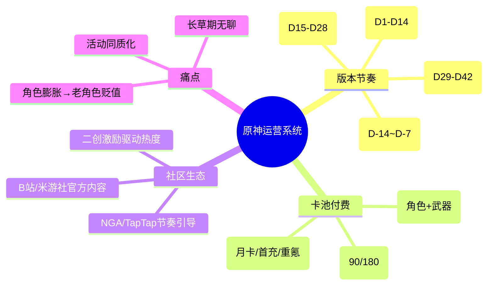

# 报告一：二次元开放世界运营系统深度拆解分析

- **标杆产品**：《原神》
- **分析维度**：版本节奏、卡池付费、社区生态、长线留存

## 核心观点

《原神》以 **42天版本 + 双卡池** 为核心引擎，通过高质量内容驱动情绪消费。  
但 **版本空窗期流失率**（第五周日活下降22%）和 **角色保值焦虑** 是最大隐患。  
未来需通过轻量玩法和角色回收机制提升粘性。

## 数据事实（公开估算）

| 指标 | 数值 | 说明 |
|------|------|------|
| 月均流水（非峰值） | 3.5~5亿人民币 | 全球iOS+安卓 |
| 七留 / 三十留 | 55% / 25% | 高于行业平均 |
| 卡池首日流水衰减系数 | 0.6 | 第二天降至首日60% |
| 版本第5周DAU降幅 | ~22% | 相较于版本初期 |
| 非硬核活动参与率 | 35% | 如摄影、跑酷类 |

## 思维导图（Mermaid）

## 优缺点分析
| 优点 | 缺点 |
|------|------|
| 版本内容量大，维持新鲜感 | 长草期活动重复（无创新玩法） |
| 双卡池控制资源回收 | 新角色强度膨胀，老角色退环境 |
| 社区二创反哺热度 | 活动参与率平均仅35%-45% |
## 改进建议
1.长草期轻量玩法：增加“随机词条挑战”、“角色试炼场”，产出限定名片/头像框，消耗体力但不增加肝度。

2.角色保值方案：引入“命座重铸系统”或“天赋跨界”机制，允许旧角色获得新技能，缓解强度焦虑。

3.社区活动升级：将“全服协力Boss”与抽卡道具挂钩，设置阶梯奖励保底，提升参与率至50%+。

