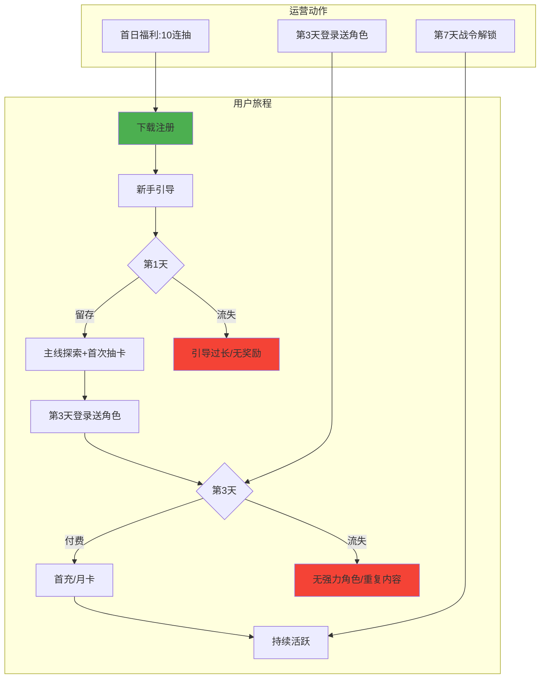

# 报告二：游戏理解与体验分析报告

- **标杆产品**：《异环》（新游）
- **分析维度**：开服冷启动、新手体验、付费设计、流失节点

## 核心观点

《异环》凭借“都市超自然开放世界”细分题材获得关注，但开服首月 **新手引导过长**（11分钟强制流程）与 **福利投放节奏失衡**（首周密集送抽，后续真空期长）导致次日留存仅45%，低于行业均值。

## 数据事实（基于测试服公开数据估算）

| 指标 | 数值 | 说明 |
|------|------|------|
| 开服首周DAU | 约300万 | 含买量 |
| 次留 | 45% | 竞品《原神》55% |
| 首周付费转化率 | 5% | 集中于首充双倍 |
| 新手第3天流失峰值 | 32% | 主线卡等级+无新奖励 |

## 用户旅程框架图（Mermaid）

## 优缺点分析
| 优点 | 缺点 |
|------|------|
| 题材新颖，视觉差异化明显 | 新手引导强制11分钟 -> 首日流失高 |
| 开服首周送30抽，刺激开局 | 福利集中在第1/3天，后续真空期长 |
| 战令系统性价比高 | 付费点（命座+专武）过早强推（第1周） |
## 改进建议
1.缩短新手引导：允许跳过教学，或将其嵌入剧情并分阶段解锁，每个阶段奖励递增。

2.均衡福利投放：将第3天送角色推迟至第7天，在第2-4周加入“登录送体力/材料”小额激励，维持日常活跃。

3.后置付费压力：将“专武保底”解锁条件改为通关第3章（约2周），给免费玩家培养时间，降低流失率。
