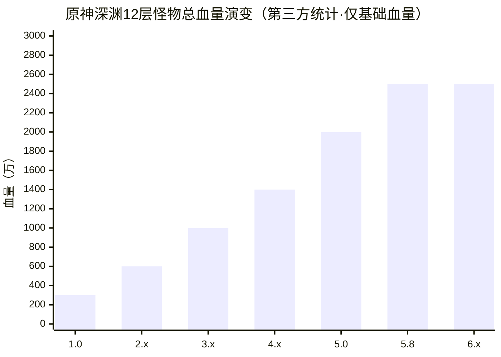

# 膨胀的两种解法：原神 vs 星穹铁道
### —— 长线二游的"水温管理"观察笔记

> **作者**：Roninozawa ｜ **更新**：2026-09 ｜ **性质**：个人研究笔记，非官方口径
> 本文基于公开社区信息（含社区解包与第三方统计）撰写，用于运营学习与研究；游戏版本更新频繁，数据快照截至 2026 年 9 月中旬。

---

## 摘要

- **膨胀是长线 PVE 二游的必然宿命**：新角色必须"卖得动"，强度迭代是商业模型的内生产物。问题从来不是"会不会膨胀"，而是"以什么形式、什么节奏膨胀，以及怎么管理玩家预期"。
- **两家给出了两种解法**：原神把膨胀从"数值"逐步转移到"机制与体系"（横向转移）；星铁更依赖"数值与环境"的纵向推进。
- **2026 年 9 月的两个新鲜样本**：原神 7.1 六周年版本完成"星反应"体系闭环，老角色迎来再就业；星铁 4.5「贪饕污染」争议发酵，官方账号被冲，海内外社区同步炸锅。
- **核心判断**：横向膨胀（体系化）将成共同方向；"规则透明化"会成为下一个运营竞争维度。

---

## 1. 先统一语言：膨胀有三种

讨论"膨胀"最怕鸡同鸭讲，先把概念拆开：

| 类型 | 定义 | 典型表现 | 玩家体感 |
|------|------|---------|---------|
| **数值膨胀** | 面板、倍率直接拔高 | 新 C 伤害碾压旧 C | "老角色退环境" |
| **机制膨胀** | 数值持平，改变"解题方式" | 新反应、新体系、新规则 | "要重新学游戏" |
| **环境膨胀** | 副本规则向新体系倾斜 | 专属怪物、buff / 惩罚机制 | "不抽就打不动" |

三者常常叠加出现，但**性质完全不同**：机制膨胀像"换了一套数学题"，考验阵容理解；数值膨胀像"把题目数字改大"，考验资源投入。玩家对两者的容忍度，天差地别。

**为什么膨胀无法避免？** 从运营视角看，这是一道商业算术题：

1. 长线 PVE 游戏必须持续推出新角色；
2. 新角色必须"卖得动"——立绘和剧情能支撑一部分购买动机，但**强度永远是最直接的购买理由**；
3. 玩家的审美阈值会疲劳，"只靠爱发电"的玩家是少数派；
4. 于是，强度迭代在商业上不可避免——区别只在包装方式。

---

## 2. 事实层：两条膨胀曲线

### 2.1 原神：一条"控制型"曲线

以最直观的标尺——深渊 12 层怪物总血量——看原神的膨胀轨迹：

| 阶段 | 版本区间 | 12层血量（约） | 特征 |
|------|---------|--------------|------|
| 蒙德试水 | 1.0–1.6 | 300–380万 | 玩法摸索期，难度保守 |
| 稻妻/须弥 | 2.0–3.8 | 600–1000万 | 第一轮数值膨胀；须弥整体平稳 |
| 枫丹狂飙 | 4.0–4.8 | 1000–1400万 | "三体人"时代，机制+数值双领先 |
| 纳塔内卷 | 5.0–5.8 | 2000万 → 2500万+ | 跨度最夸张阶段，较蒙德膨胀约 7 倍 |
| 挪德卡莱转型 | 6.0–6.3 | 基础血量停滞 | **转向机制膨胀**：专属原魔、新体系门槛 |

三个阶段非常清晰：**先数值、后机制、再到体系**。

最新的观察样本是 7.1 六周年版本「往冥府的安魂歌」：随着"星超导"与"星扩散"两条支线成型，"星反应"体系完成闭环，版本环境从"单卡数值"转向"**体系协同**"——配队完整度比单个角色的面板更能决定上限。更值得注意的是老角色生态：部分老角色（如八重神子、赛诺等，据社区攻略梳理）凭与新体系的适配性重新获得岗位，社区称之为"第二春"；传统高数值主 C 在特定机制环境下效率受限，但常规环境依然能打。

### 2.2 星铁：一条"激进型"曲线

星铁的膨胀体感更陡，2026 年 8–9 月的「贪饕污染」事件是最好的切片：

| 时间 | 事件 |
|------|------|
| 8/26 | 4.5 版本「挥掷千星的筹码」上线 |
| 8月下旬 | "贪饕复苏"怪物随机出现在遗器副本，玩家察觉异常 |
| 8/30 | 攻略 UP 主解析：全网无官方机制说明，数值靠解包——污染 2 级怪物血量 +70%，3 级 +144%，且 3 级对当期"欢愉"体系放水 |
| 8/31 | 第二期「末日幻影·仙客天狼」上线，星启模式 BOSS 血量至约 6000 万 |
| 8/31 晚 | 官方微博评论区失控：两条抽奖动态合计约 3.7 万条评论 |
| 9/1 凌晨 | 单条突破 4.6 万评论；海外社区同步发酵 |
| 后续 | 4.6 前瞻定档；社区传闻污染机制将延续（未获官方证实） |

**争议核心不是"难"，是"收益结构变了"：**

- 奖励侧：三深渊（忘却/虚构/末日）每期打满 800 星琼，星启模式 +100——**一分没涨**；
- 成本侧：不抽当期体系，同样的怪多打 70%–144% 的血——**惩罚加了**；
- 信息侧：前瞻直播只字未提，机制全靠解包——**规则改了却不说**。

社区的一句总结被顶到最高：**"抽对没奖励，抽错有惩罚。"** 这句话精确描述了期望值的移动——新体系的收益不再来自"抽卡时的强度承诺"，而来自"不买就罚"的机制背书。

补充公平性：这期并非"平民绝路"，社区有低配通关记录；攻略生态的共识是"对策倾向越来越明显"——考的不是单队强度，而是 box 广度。真正点燃情绪的，是"不预告、不解释、奖励冻结"三件事的叠加。

### 2.3 对照表

| 维度 | 原神 | 星穹铁道 |
|------|------|---------|
| 玩法结构 | 开放世界 + 操作乘区 | 回合制站桩，数值与配队权重高 |
| 膨胀主形式 | 数值 → 机制 → 体系（横向转移） | 数值 + 环境（纵向推进为主） |
| 卖卡节奏 | 节奏相对慢，复刻池缓冲 | 双新限定 + 光锥，卡位密集 |
| 老角色处理 | 新体系预留接入位 | 依赖强化与队友补强 |
| 环境设计 | 倾向留"通解"，老体系可苟 | 对策倾向明显，考 box 广度 |
| 近期舆情 | 体系转型期有讨论，整体平稳 | 4.5 污染事件，海内外炸锅 |

---

## 3. 为什么体感差异这么大：四个结构性原因

**① 操作乘区：原神能用"手"消化膨胀，星铁只能用"钱"和"时间"。**
原神是动作游戏，走位、操作、元素反应理解可以抵消一部分数值压力；星铁回合制，同样的 +144% 血量就是实打实多打 144%。**膨胀的"体感单价"天然不同。**

**② 内容缓冲垫：大世界稀释了强度焦虑。**
原神玩家大量时间花在探索、剧情、活动上，强度焦虑有"泄洪口"；星铁内容消耗快，长草期注意力全落在"深渊打分"上——**同样的水温，泡澡的人体感不同。**

**③ 商业化节奏：卡位密度决定"膨胀频率"。**
星铁双新限定 + 光锥池的密度更高，"必须让新卡值得买"的压力传导更快；原神节奏缓、复刻多，膨胀的货币化压力相对低。

**④ 环境哲学："通解"还是"对策"。**
原神倾向为环境预留一个泛用解，让老阵容仍有活路；星铁 4.5 的环境三间分别利好三个不同体系——**"你有解"和"你得有这个解"，玩家感受完全不同。**

---

## 4. 深入一层：膨胀的本质是"预期管理"

把镜头拉远：玩家抽一张卡时，买的不是"当期强度"，而是**一段时间的"安全感"**——不妨称之为"抽卡契约"：我付出成本，你承诺一定窗口期内的强度地位。

膨胀的每一次推进，本质都是**这份契约的重新定价**。定价本身不是问题（玩家早已接受"会膨胀"），问题在于**定价的方式**：

- **4.5 的三个翻车变量**：信息差（不预告）+ 奖励冻结（抽对没奖励）+ 惩罚式设计（不买就罚）——三者叠加，契约被"单方面修改"，情绪才会爆炸。**玩家愤怒的与其说是"打不过"，不如说是"规则改了却不贴公告"。**
- **7.1 的示范意义**：把"淘汰"做成"转岗"——新体系给老角色留接口，牺牲一点短期的卖卡纯度，换社区的长期信任。**旧资产的贬值速度，直接决定玩家敢不敢继续投资。**

一句话：**膨胀管理的胜负手，不在数值表，在预期表。**

---

## 5. 未来如何发展：五个判断

> 以下为个人观察与推演，非预测承诺。

**判断一：横向膨胀（体系化）将成为共同方向。**
两家都在从"单卡强度"转向"体系协同"：原神走月反应 → 星反应的体系路线；星铁用记忆/击破/欢愉等体系轮换环境。未来的膨胀不再是"谁倍率高"，而是"谁的体系拼图更完整、新体系对老资产的兼容性如何"。

**判断二："环境税"存在情绪警戒线，惩罚式设计会向奖励式偏移。**
4.5 证明"惩罚缺卡 + 信息不透明"的组合接近红线。预计行业会更倾向"奖励持卡"（正向激励）而非"惩罚缺卡"（负向逼迫），机制说明会逐步前置到官方渠道。

**判断三：老角色"再就业"机制将标配化。**
老角色的资产保值（体系接入、强化、转职、新队友补强）会成为长线运营的标配工具——它同时服务留存（老玩家回坑）与信任（抽卡敢下手）。**"角色不是消耗品，是可运营的长期资产。"**

**判断四：透明化与预期管理成为下一个竞争维度。**
解包文化消解了官方对信息的垄断，谁先把"机制说明、强度边界、环境预告"制度化，谁少挨一轮舆情。**舆情的第一性原理：愤怒往往不来自"变难"，而来自"规则不透明"。**

**判断五：玩家侧的规划逻辑从"数值"转向"体系"。**
抽卡决策正在从"看倍率表"变成"看体系位置与豁免权"。对运营侧的启示：设计新体系时，要同时算两笔账——**新玩家的进入门槛，与老玩家的沉没成本。**

---

## 6. 运营启示（写给同为运营学习者的人）

1. **膨胀不可耻，不可控才可耻。** 膨胀管理 = 内容供给 × 预期管理 × 商业化节奏的三角平衡，缺一角都会出事。
2. **"感受差"比"数值差"更重要。** 同样是多打 144% 的血，包装成"新挑战"还是"不买就罚"，社区反应截然相反——这中间的差距叫运营。
3. **给旧资产留接口，是最便宜的信任投资。** 老角色能"转岗"的游戏，玩家才敢"入职"。
4. **信息透明度是体验的一部分。** 闷声改规则，等于亲手把玩家推向解包 UP 主的评论区。

---

## 7. 数据与口径说明

- 原神深渊 12 层血量序列：第三方统计汇编（仅基础血量，不含护盾与机制增伤），转引自 genshin321《原神深渊血量膨胀史》；
- 原神 7.1「星反应」体系与角色梯队：社区攻略站 niubi.wiki 梳理（2026-09-19），非官方口径；
- 星铁 4.5「贪饕污染」事件（+70% / +144%、6000 万血、评论数等）：社区解包与攻略统计，转引自什么值得买社区分析；
- 膨胀类型（数值/机制）讨论框架：参考 genshin321《二游环境迭代替代：深扒长线 PVE 游戏的膨胀宿命》；
- 本文为个人研究笔记，与任何公司无关；所有数据请以官方公告为准。

---

*本文为「游戏运营/发行 · 个人知识库」的一部分，用于学习交流与个人展示。*
